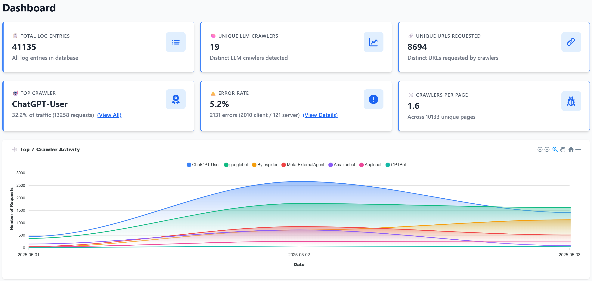
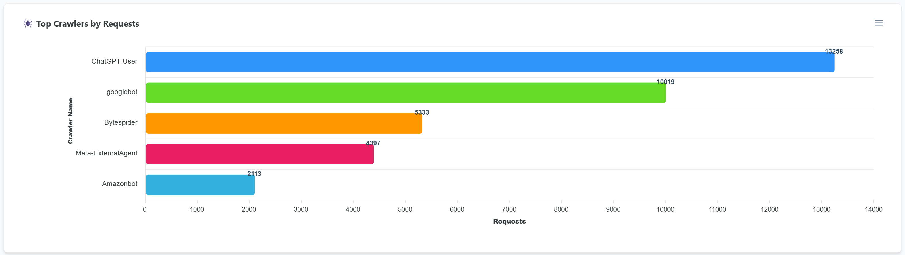
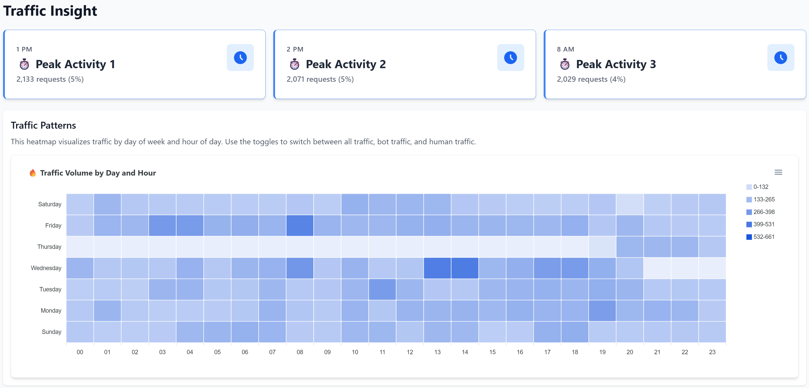
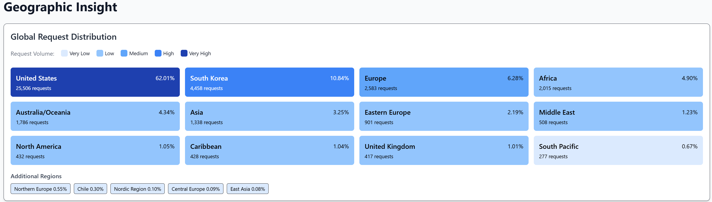
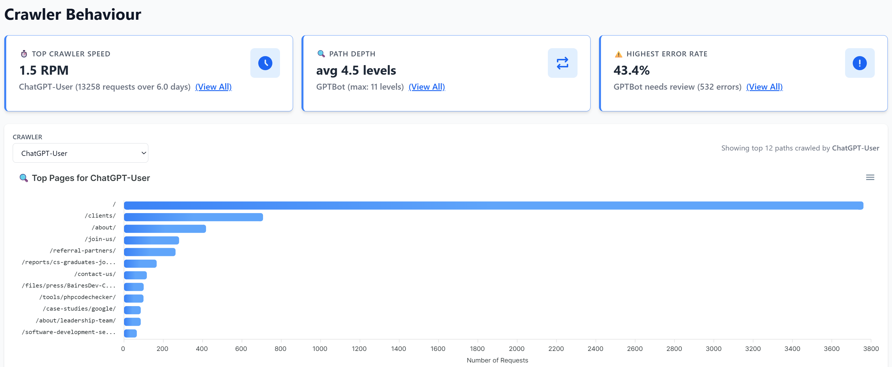
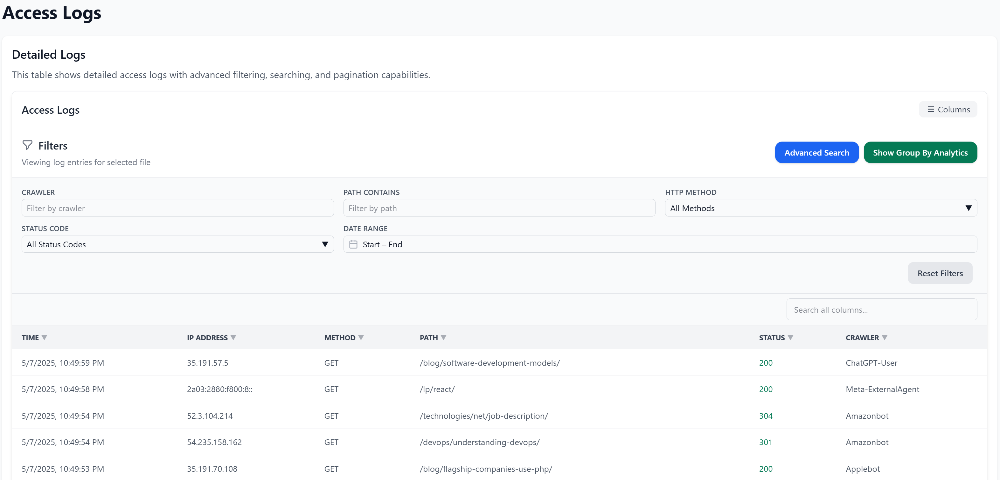
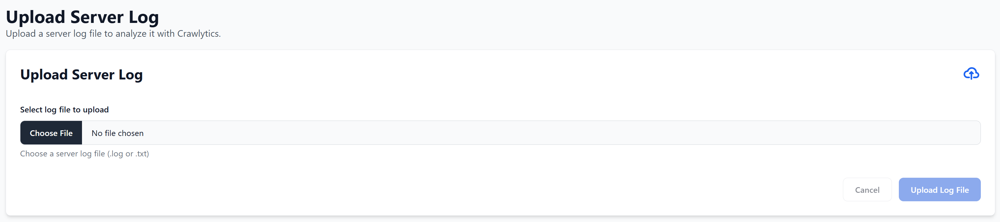
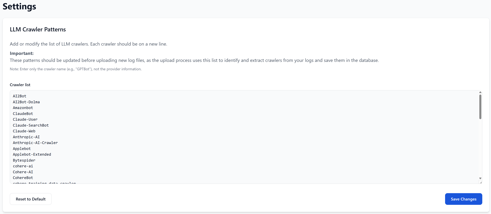
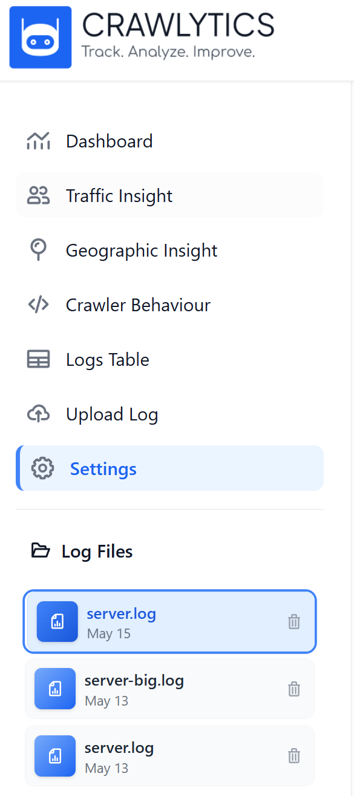

# Crawlytics

## Overview

Crawlytics is an open-source analytics platform for detecting, analyzing, and visualizing Large Language Model (LLM) crawler traffic in server logs. This tool processes Apache and Nginx log files to identify and extract requests from AI crawlers such as ChatGPT, Gemini, Claude, and other LLM-based systems.

This project is 100% free and open-source software.

## Core Functionality

- **LLM Crawler Detection**: Identifies requests from AI systems in standard server logs
- **Data Visualization**: Provides heatmaps, charts, and geographic maps for traffic analysis
- **High-Performance Processing**: Efficiently processes large log files using parallel processing
- **SQL Query Interface**: Supports read-only SQL queries for custom data exploration
- **Multi-dimensional Analysis**: Examines traffic patterns by time, geography, and crawler type
- **Detailed Log Inspection**: Offers filterable, paginated views of individual log entries

## Architecture

- **Backend**: Python/FastAPI application with SQLite database for storage and query processing
- **Frontend**: React-based dashboard with responsive visualizations
- **Packaging**: Build scripts for creating standalone executables

## Setup Instructions

1. **Clone repository**:
   ```
   git clone https://github.com/danilotrix86/crawlytics.git
   cd crawlytics\backend
   ```

2. **Configure Python environment**:
   ```
   python -m venv venv  # Windows
   # OR
   python3 -m venv venv  # Linux/Mac
   .\venv\Scripts\activate  # Windows
   source venv/bin/activate  # Linux/Mac
   ```
3. **Install backend dependencies**:
   ```
   pip install -r requirements.txt  # Windows
   # OR
   pip3 install -r requirements.txt  # Linux/Mac
   ```
   
4. **Start the application**:
   ```
   python run_app.py  # Windows
   # OR
   python3 run_app.py  # Linux/Mac
   ```

## Launching After first time Setup

Once you have completed the initial setup, you don't need to repeat all steps when launching the application in the future:

1. **Navigate to the backend directory**:
   ```
   cd crawlytics\backend
   ```

2. **Activate the virtual environment**:
   ```
   .\venv\Scripts\activate  # Windows
   # OR
   source venv/bin/activate  # Linux/Mac
   ```

3. **Start the server**:
   ```
   python run_app.py  # Windows
   # OR
   python3 run_app.py  # Linux/Mac
   ```

## Frontend Development

**Note**: The following section is only relevant if you intend to make changes to the frontend code. These steps are not required for normal usage of the application.

After modifying frontend code, rebuild and copy to the backend directory:

**Windows**:
```
cd fe
npm install
npm run build
cd ..
xcopy /E /I /Y fe\dist backend\react
```

**Mac/Linux**:
```
cd fe
npm install
npm run build
cd ..
mkdir -p backend/react
cp -R fe/dist/* backend/react/
```

## Customizing LLM Crawler Detection

You can customize which LLM crawlers are detected by editing the crawler patterns list in `backend/parser/llm_list.py`. This allows you to:

- Add new LLM crawler user agent patterns as they emerge
- Remove patterns you don't want to track
- Modify existing patterns to improve detection accuracy

Example of the crawler patterns list:
```python
LLM_CRAWLER_PATTERNS = [
    # OpenAI
    "GPTBot",
    "ChatGPT-User",
    "OAI-SearchBot",

    # Anthropic
    "ClaudeBot",
    "Claude-Web",
    "Anthropic-AI",
    
    # Google
    "googlebot",
    "Google-Extended",
    
    # Add your custom patterns here
    "Your-Custom-LLM-Crawler",
]
```

Make these changes before processing log files to ensure they're detected correctly.

## Screenshots

### Main Dashboard



The main dashboard provides a comprehensive overview of your website's crawler activity:
- Total log entries with detailed database statistics
- Unique LLM crawlers detected with crawler identification
- Distinct URLs requested by crawlers showing content accessed
- Top crawler statistics with percentage breakdowns
- Error rate analysis with client/server error distribution
- Crawler density metrics showing average crawlers per page

### Top Crawler Activity Timeline



The stacked area chart shows crawler activity over time:
- Visualizes traffic patterns for multiple crawler types simultaneously
- Color-coded areas for each crawler (ChatGPT-User, Googlebot, Bytespider, etc.)
- Daily activity trends showing peak usage periods
- Comparative view of crawler distribution and market share

### Top Crawlers by Request Volume



This horizontal bar chart provides a clear ranking of crawlers by total requests:
- Visual comparison of different crawler activities
- Ranked display of most active crawlers
- Clear visualization of relative crawler activity
- Complete ranking of all significant LLM and traditional crawlers

### Traffic Insight Peaks



The traffic insights section highlights key activity periods:
- Peak activity times with precise request counts
- Percentage of traffic during high-volume periods
- Time-based pattern analysis for capacity planning
- Quick identification of when your content is most accessed

### Traffic Heatmap by Day and Hour



The detailed heatmap visualization shows:
- Traffic intensity by day of week and hour of day
- Color gradient indicating request volume
- Clear patterns of high and low activity periods
- Easy identification of when LLM crawlers are most active on your site

### Geographic Distribution



The geographic insight panel displays:
- Global request distribution with percentage breakdowns
- Color-coded regions by request volume
- Regional traffic patterns and hotspots
- Comprehensive breakdown of traffic sources by region

### Crawler Behavior Analysis



The crawler behavior panel provides advanced metrics:
- Crawler speed metrics showing requests per minute
- Path depth analysis showing navigation patterns
- Error rate statistics with troubleshooting guidance
- Path analysis showing most accessed content by crawler

### Detailed Access Logs



The logs table provides granular access to your data:
- Advanced filtering by crawler, path, method, and status code
- Date range selection with precise timestamps
- Real-time IP address and request details
- Sortable columns for customized analysis

### Log File Upload



The simple upload interface allows you to:
- Select and upload server log files (.log or .txt)
- Process Apache, Nginx, or other standard log formats
- Automatically analyze and extract LLM crawler data
- Seamlessly integrate new data into your analytics

### LLM Crawler Settings


The settings panel allows you to customize crawler detection:
- Maintain a comprehensive list of LLM crawler patterns
- Add new crawler user agents as they emerge
- Configure detection parameters for optimal accuracy
- Reset to default patterns or save custom configurations

### Navigation Interface


The sidebar navigation provides quick access to:
- Dashboard overview and key metrics
- Traffic insight and pattern analysis
- Geographic distribution visualization
- Crawler behavior statistics
- Detailed logs table with filtering
- Log file upload interface
- Settings and configuration options
- Log file management and organization

## Contact

For questions, feature requests, or technical support, please:
- [Open an issue](https://github.com/danilotrix86/crawlitycs/issues) on GitHub (preferred)
- Send an email to the maintainer with "CRAWLYTICS" in the subject line: danilo.vaccalluzzo@gmail.com

## License

Crawlytics is released under the [MIT License](LICENSE).

This means you can:
- Use the software commercially
- Modify the source code
- Distribute modified versions
- Use it privately
- Sublicense it

The only requirement is to include the original copyright notice and license text in any copy of the software/source.

Copyright (c) 2024 Danilo Vaccalluzzo

---

Contributions welcome. Report issues via GitHub.
