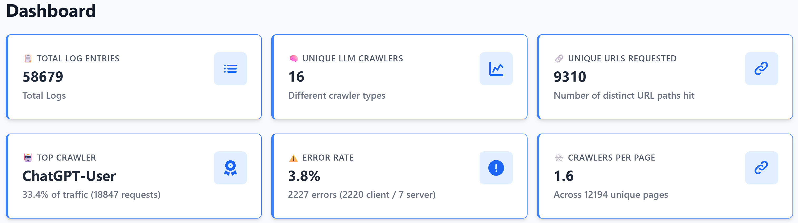
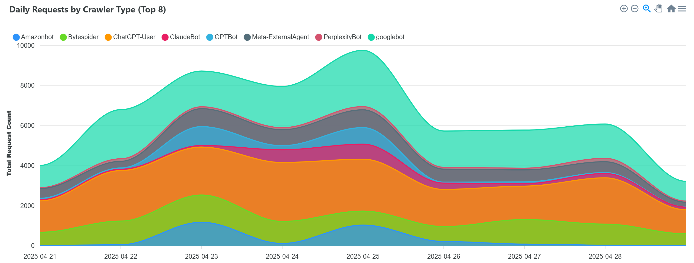
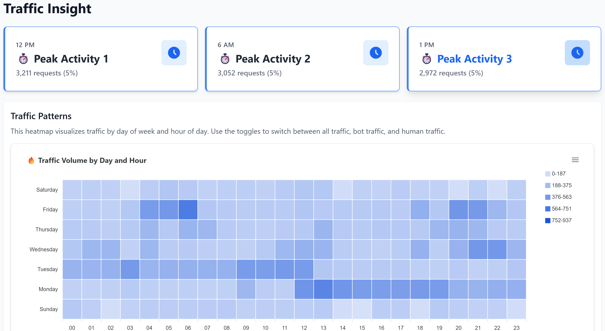
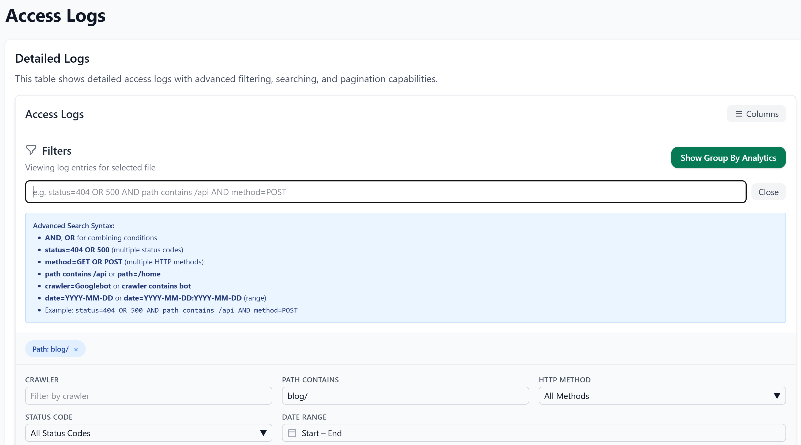
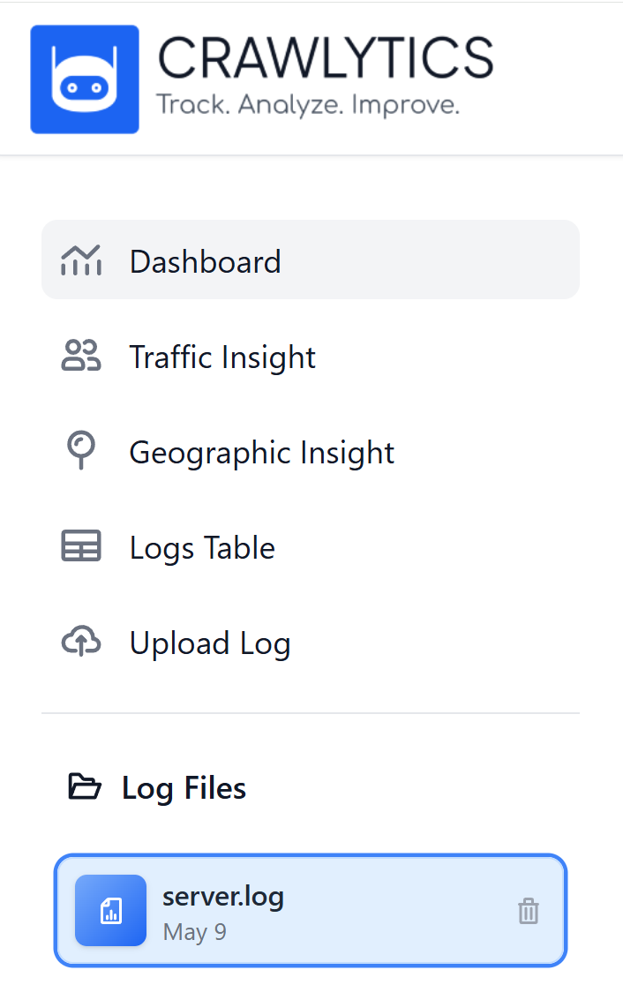

# Crawlytics

## Overview

Crawlytics is an open-source analytics platform for detecting, analyzing, and visualizing Large Language Model (LLM) crawler traffic in server logs. This tool processes Apache and Nginx log files to identify and extract requests from AI crawlers such as ChatGPT, Gemini, Claude, and other LLM-based systems.

This project is 100% free and open-source software.

## Core Functionality

- **LLM Crawler Detection**: Identifies requests from AI systems in standard server logs
- **Data Visualization**: Provides heatmaps, charts, and geographic maps for traffic analysis
- **High-Performance Processing**: Efficiently processes large log files using parallel processing
- **SQL Query Interface**: Supports read-only SQL queries for custom data exploration
- **Multi-dimensional Analysis**: Examines traffic patterns by time, geography, and crawler type
- **Detailed Log Inspection**: Offers filterable, paginated views of individual log entries

## Architecture

- **Backend**: Python/FastAPI application with SQLite database for storage and query processing
- **Frontend**: React-based dashboard with responsive visualizations
- **Packaging**: Build scripts for creating standalone executables

## Setup Instructions

1. **Clone repository**:
   ```
   git clone https://github.com/danilotrix86/crawlytics.git
   cd crawlytics\backend
   ```

2. **Configure Python environment**:
   ```
   python -m venv venv  # Windows
   # OR
   python3 -m venv venv  # Linux/Mac
   .\venv\Scripts\activate  # Windows
   source venv/bin/activate  # Linux/Mac
   ```
3. **Install backend dependencies**:
   ```
   pip install -r requirements.txt  # Windows
   # OR
   pip3 install -r requirements.txt  # Linux/Mac
   ```
   
4. **Start backend server**:
   ```
   python run_app.py  # Windows
   # OR
   python3 run_app.py  # Linux/Mac
   ```

## Launching After Installation

Once you have completed the initial setup, you don't need to repeat all steps when launching the application in the future:

1. **Navigate to the backend directory**:
   ```
   cd crawlytics\backend
   ```

2. **Activate the virtual environment**:
   ```
   .\venv\Scripts\activate  # Windows
   # OR
   source venv/bin/activate  # Linux/Mac
   ```

3. **Start the server**:
   ```
   python run_app.py  # Windows
   # OR
   python3 run_app.py  # Linux/Mac
   ```

## Frontend Development

**Note**: The following section is only relevant if you intend to make changes to the frontend code. These steps are not required for normal usage of the application.

After modifying frontend code, rebuild and copy to the backend directory:

**Windows**:
```
cd fe
npm install
npm run build
cd ..
xcopy /E /I /Y fe\dist backend\react
```

**Mac/Linux**:
```
cd fe
npm install
npm run build
cd ..
mkdir -p backend/react
cp -R fe/dist/* backend/react/
```

## Customizing LLM Crawler Detection

You can customize which LLM crawlers are detected by editing the crawler patterns list in `backend/parser/llm_list.py`. This allows you to:

- Add new LLM crawler user agent patterns as they emerge
- Remove patterns you don't want to track
- Modify existing patterns to improve detection accuracy

Example of the crawler patterns list:
```python
LLM_CRAWLER_PATTERNS = [
    # OpenAI
    "GPTBot",
    "ChatGPT-User",
    "OAI-SearchBot",

    # Anthropic
    "ClaudeBot",
    "Claude-Web",
    "Anthropic-AI",
    
    # Google
    "googlebot",
    "Google-Extended",
    
    # Add your custom patterns here
    "Your-Custom-LLM-Crawler",
]
```

Make these changes before processing log files to ensure they're detected correctly.

## Distribution

Create a standalone executable using the build script:

**Windows**:
```
build.bat
```

**Note**: The packaging script is currently only available for Windows. For Mac/Linux, follow the manual build steps above.

The script handles:
- Frontend compilation
- Asset cleanup and preparation
- Backend bundling via PyInstaller
- Archive creation for distribution

## Implementation Details

- **Frontend Components**: Located in `fe/src/components/`
- **Backend Services**: 
  - Log processing: `backend/processor/`
  - API routes: `backend/routes/`
  - Database operations: `backend/database/`

## Screenshots

### Dashboard Overview



The main dashboard displays key metrics about your log data:
- Total log entries processed
- Number of unique LLM crawlers detected
- Unique URLs requested by crawlers
- Top crawler by traffic volume
- Error rate statistics
- Average crawlers per page

### Crawler Traffic Analysis



The stacked area chart visualizes daily crawler activity by type, allowing you to:
- Track traffic patterns over time
- Compare relative activity between different AI systems
- Identify peak crawler activity periods
- Monitor trends in which AI systems are most active on your site

### Traffic Patterns Heatmap



The traffic insights page features heatmaps showing:
- Traffic volume by day of week and hour
- Peak activity periods with precise request counts
- Color intensity indicating request volume
- Ability to identify when AI crawlers are most active on your site

### Log Upload Interface


The simple upload interface allows you to:
- Select and upload server log files (.log)
- Process Apache or Nginx log files
- Automatically analyze and extract LLM crawler data

### Detailed Log Analysis



The logs table provides granular access to your data:
- Advanced filtering with SQL-like query syntax
- Filter by crawler type, path, HTTP method, status code, and date
- View raw log entries with their associated metadata
- Toggle between grouped analytics and individual entries

### Navigation Interface



The sidebar navigation provides quick access to:
- Dashboard overview
- Traffic insights
- Geographic visualization
- Logs tables
- File upload
- Log file management

## Contact

For questions, feature requests, or technical support, please:
- [Open an issue](https://github.com/danilotrix86/crawlitycs/issues) on GitHub (preferred)
- Send an email to the maintainer with "CRAWLYTICS" in the subject line: danilo.vaccalluzzo@gmail.com

## License

Crawlytics is released under the [MIT License](LICENSE).

This means you can:
- Use the software commercially
- Modify the source code
- Distribute modified versions
- Use it privately
- Sublicense it

The only requirement is to include the original copyright notice and license text in any copy of the software/source.

Copyright (c) 2024 Danilo Vaccalluzzo

---

Contributions welcome. Report issues via GitHub.
